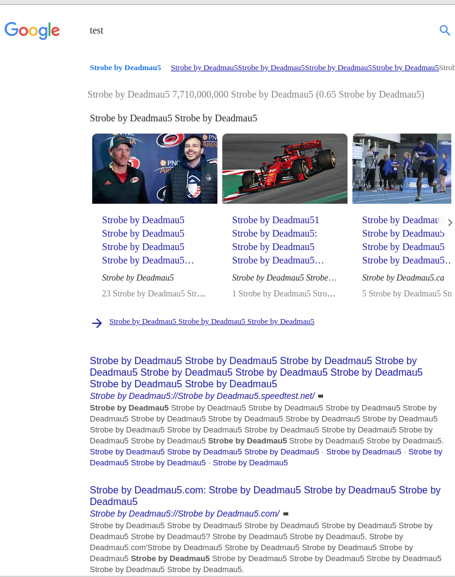

# StrobeCircleJerk's 'Strobe by Deadmau5'

## About 
A chrome extension to replace every word with 'Strobe By Deadmau5', and play that auditory kashmir on repeat in the background.
Inspired by [this reddit post](https://www.reddit.com/r/strobecirclejerk/comments/askw0q/we_need_a_strobe_google_chrome_add_on/) by [u/crazzzzzzzy_person](https://www.reddit.com/user/crazzzzzzzy_person).
As Strobe by Deadmau5 is the greatest entity in existence, I am not wholly sure how the internet was usable before this extension...

## Usage
First download the `.zip` file from the [releases](https://github.com/ryco117/SCJs_StrobeByDeadmau5/releases) page and extract the folder inside.
Then, in Chrome, enable `Developer mode` under [chrome://extensions/](chrome://extensions/) and press `Load unpacked` to select and load the extracted folder. Then you're done!

## Google Example

